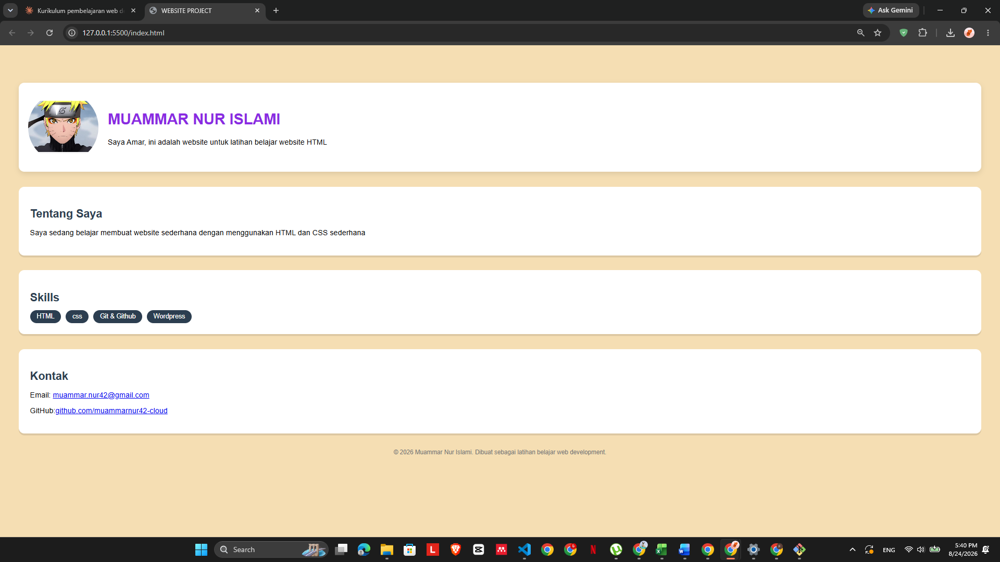

# Website Project — Landing Page Profil

Landing page personal sederhana yang saya buat sebagai bagian dari proses belajar web development.

## 🎯 Tujuan Proyek
Proyek latihan Fase 1 dari kurikulum belajar saya: memahami dasar HTML, CSS, Flexbox, dan workflow Git/GitHub.

## 🛠️ Dibangun Dengan
- HTML5
- CSS3 (Flexbox, Box Shadow, Hover Effects)
- Git & GitHub untuk version control

## ✨ Fitur
- Layout profil dengan foto bulat menggunakan Flexbox
- Section Tentang Saya, Skills, dan Kontak
- Efek hover interaktif pada foto profil
- Desain responsif dengan card dan shadow

## 📸 Preview

## 🚀 Cara Menjalankan
1. Clone repository ini
2. Buka `index.html` di browser, atau gunakan Live Server di VS Code

## 📚 Status Belajar
Proyek ini adalah bagian dari Fase 1 (Fondasi HTML & CSS) dalam kurikulum belajar web development saya. Selanjutnya saya akan mempelajari JavaScript untuk menambah interaktivitas.

---
Dibuat oleh Muammar Nur Islami8